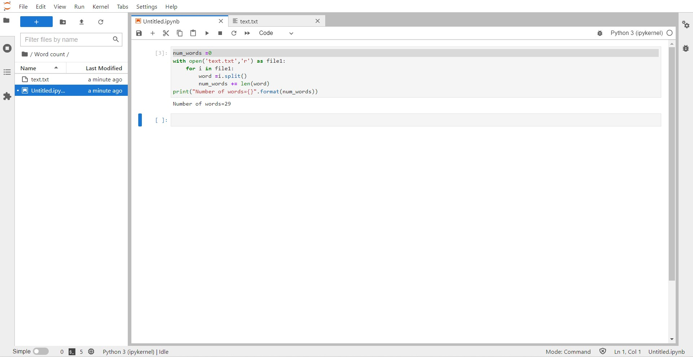
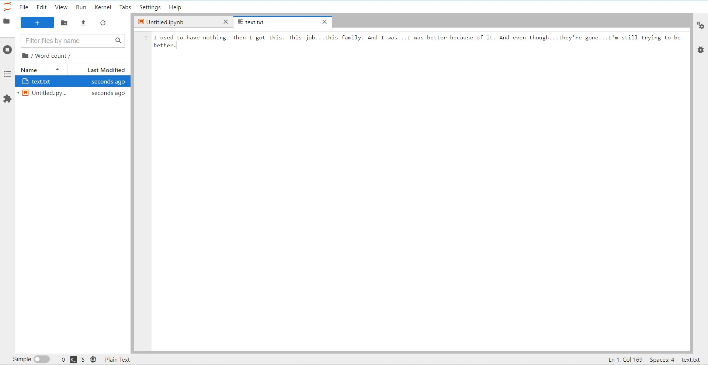

# Word-count
## AIM:
To write a python program for getting the word count from a text.
## EQUIPEMENT'S REQUIRED: 
PC
Anaconda - Python 3.7
## ALGORITHM: 
### Step 1:
As a first step create a .text file

### Step 2:
Add some sentence to the file

### Step 3:
Now in the main.py file using split function,split the words in the .txt file

### Step 4:
Count the splitted Words

### Step 5:
Add the counted number in the variable

### Step 6:
Run the program and display the results
## PROGRAM:
~~~
num=0
fp=open("file.txt",'r')
for i in fp:
    word=i.split()
    num+=len(word)
    print("Number of words={}".format(num))
~~~
### OUTPUT:

## RESULT:
Thus the program is written to find the word count from a text.
